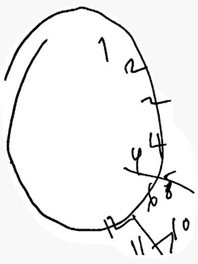

# Taller 1 - Fundamentos Web

Nombre: Cristian Andrés Revelo Mejía

Este repositorio contiene el primer taller de HTML de la asignatura
Fundamentos de Programación Web (grupo 4303, UNIAJC).

## Descripción

Página "Mi espacio universitario" construida únicamente con HTML5 (sin CSS ni
JavaScript), que presenta información personal, intereses académicos,
recursos multimedia, horario y un formulario de contacto.

## Verificación de código

### Caso A

**Problema identificado:** el elemento usaba `href` en lugar de `src`.
`` no tiene atributo `href`; sin `src` el navegador no tiene de dónde
cargar la imagen, así que no se muestra nada (solo aparecería el texto del
`alt`, si se hubiera puesto).

**Corrección realizada:**
```html

```

**Fuente consultada:** documentación de `` en MDN Web Docs
(developer.mozilla.org/es/docs/Web/HTML/Element/img).

### Caso B

**Problema identificado:** el enlace usaba `src` en lugar de `href`. El
atributo `src` no existe para `<a>` (es propio de elementos como ``,
`<audio>` o `<video>`); sin `href` el elemento no funciona como enlace y no es
posible hacer clic para navegar.

**Corrección realizada:**
```html
<a href="https://developer.mozilla.org/">Consultar MDN</a>
```

**Fuente consultada:** documentación de `<a>` en MDN Web Docs
(developer.mozilla.org/es/docs/Web/HTML/Element/a).

### Caso C

**Problema identificado:** el elemento `<source>` usaba `href` en lugar de
`src`. Al igual que en ``, `<source>` necesita `src` para indicar la
ruta del archivo; con `href` el navegador no encuentra el video y solo se
mostraría el mensaje alternativo.

**Corrección realizada:**
```html
<video controls>
  <source src="multimedia/video.mp4" type="video/mp4">
  Su navegador no soporta video HTML5.
</video>
```

**Fuente consultada:** documentación de `<source>` en MDN Web Docs
(developer.mozilla.org/es/docs/Web/HTML/Element/source).

### Caso D

**Problema identificado:** `"correo"` no es un valor válido para el atributo
`type` de `<input>`. La especificación HTML5 define un conjunto cerrado de
valores (`text`, `email`, `number`, `date`, `range`, etc.); un valor no
reconocido hace que el navegador trate el campo como `type="text"`, perdiendo
la validación automática de formato de correo.

**Corrección realizada:**
```html
<label for="correo-caso-d">Correo:</label>
<input type="email" id="correo-caso-d" name="correo">
```

**Fuente consultada:** documentación de `<input>` y sus tipos en MDN Web Docs
(developer.mozilla.org/es/docs/Web/HTML/Element/input).

### Caso E

**La afirmación es:** falsa.

**Justificación:** HTML5 no define ninguna etiqueta `<image>`. La etiqueta
estándar para insertar imágenes es ``, y además `` es un elemento
vacío (void element): no envuelve contenido y no lleva etiqueta de cierre
(`</img>` no existe ni es válido). La forma correcta es:
```html

```

**Fuente consultada:** especificación de elementos vacíos y documentación de
`` en MDN Web Docs (developer.mozilla.org/es/docs/Web/HTML/Element/img
y developer.mozilla.org/en-US/docs/Glossary/Void_element).

## Historial de commits sugerido

1. Creación de la estructura inicial HTML
2. Adición de información personal e intereses y navegación
3. Adición de imágenes y multimedia
4. Creación de tabla y formulario
5. Corrección de errores del reto de verificación y finalización del taller

Nota: Todo esto fue estilizado por una IA, a razón de ser más fácilemente legible
